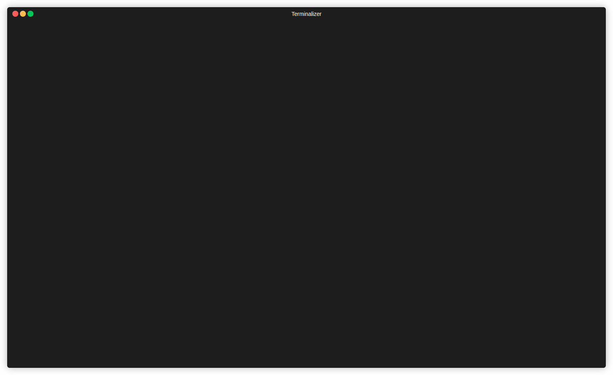

# Task 3 DSW: Program for Calculating Exchange Rate Differences
[](https://github.com/Qwizi/task3-dsw/actions/workflows/test.yml)

[](https://python-poetry.org/)
[](https://github.com/astral-sh/ruff)
[](https://github.com/pre-commit/pre-commit)

This program is designed to calculate differences in exchange rates.

## Getting Started

These instructions will get you a copy of the project up and running on your local machine for development and testing purposes.

### Prerequisites

- Python 3.8 or higher
- Poetry
- Git

### Installation

1. **Install Poetry**: [Poetry](https://python-poetry.org/docs/#installation) is a tool for dependency management and packaging in Python. You can use [pipx](https://pipx.pypa.io/stable/installation/) to install it globally, which is recommended.

    ```shell
    pipx install poetry
    ```

2. **Clone the repository**: This will create a copy of this project on your local machine.

    ```shell
    git clone https://github.com/Qwizi/task3-dsw
    ```

3. **Install dependencies**: Navigate into the cloned project's directory and install the necessary dependencies.

    ```shell
    cd task3-dsw
    poetry install
    ```

4. **Activate the virtual environment and install pre-commit hooks**: This step ensures that the hooks are installed and active.

    ```shell
    poetry shell
    pre-commit install --hook-type pre-commit --hook-type pre-push
    ```

## Usage

After following the installation steps, you can start using the program to calculate exchange rate differences. (Provide instructions on how to use the program here)

**Run program in interactive mode with verbose**
```shell
cd task3_dsw
python main.py -i -v
```


## Features check list
- [x] Konfiguracja walut
- [x] Wprowadzanie danych płatności
- [x] Pobieranie kursów walut
- [ ] Wyliczanie różnic kursowych
- [x] Zapis danych do pliku
- [ ] Dokumentacja
- [x] Obsługa błędów i walidacja danych
- [ ] Pomoc i instrukcja
- [x] Standardy Nazewnictwa i Komentarze
- [ ] Raport Projektowy
- [x] Przestrzeganie Standardów PEP 8
- [ ] Dokumentacja Kodu
- [x] Wprowadzanie danych faktury
- [ ] Podsumowanie płatności
- [ ] Optymalizacja Wydajności
- [ ] Tryb wsadowy i dokumentacja
- [x] Tryp interaktywny
- [x] Zarządzanie Kodem za Pomocą Git
- [x] Testowanie Jednostkowe

## Legal info
© Copyright by Adrian Ciołek (@Qwizi), Mateusz Cyran (@Kuis03), Kamil Duszyński (@VirdisPl).
test 123